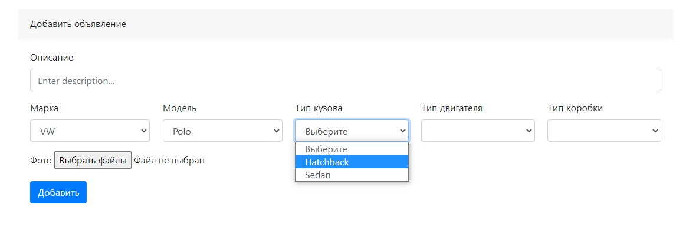
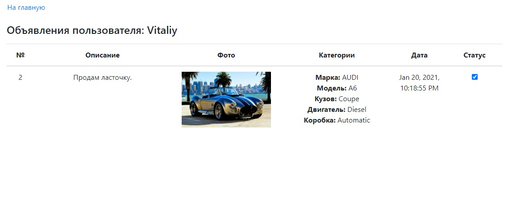

# Площадка продажи машин.

##### Использовано в проекте:
- ***JUnit*** - библиотека для модульного тестирования.
- ***Maven*** - фреймворк для автоматизации сборки проектов.
- ***Git*** - распределённая система управления версиями.
- ***JaCoCo*** - библиотека для анализа покрытия кода.
- ***Travis CI*** - сервис для сборки и тестирования ПО.

---

## О проекте.
### Проект преставляет собой площадку для размещения объявлений о продаже автомобилей.
Главная страница со всеми объявлениями.

Страница добавления объявления.

Личный кабинет с возможностью отметить завершенное объявление(только для создателя объявления).

---

## Контакты.

***email:*** moroz.future@gmail.com